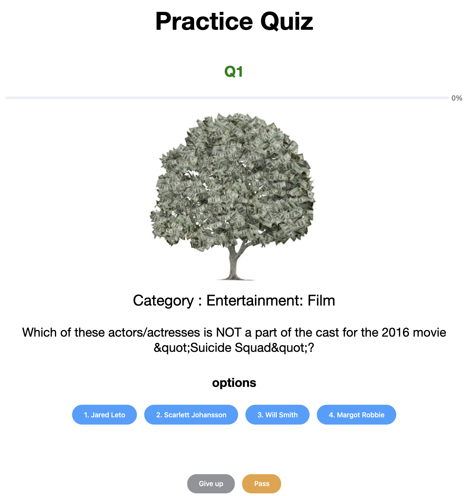

## In the beginning
This was created during my time as a student at Code Chrysalis.
It is 2 and a half days project using Vue or React.

# Quiz Practice Application
I created this Quiz application which generate quiz randamly and automatically.
After the authentication, you can use it. I'll delete your address and never use it. So feel free to use it. You can choose 3 levels of quiz. And there are 5 quiz at once.


generated by [freelogodesign](https://www.freelogodesign.org/)

This is a [Nuxt.js](https://nuxtjs.org/) project with [Firebase](https://firebase.google.com/).
It is kind of a quiz application which uses "[Open TRIVIA DATABASE](https://opentdb.com/api_config.php)" and [Firebase authentication](https://firebase.google.com/docs/auth).

## Resources
- [Nuxt.js](https://nuxtjs.org/)
- [Firebase](https://firebase.google.com/)
- [Firebase authentication](https://firebase.google.com/docs/auth)
- [Open TRIVIA DATABASE](https://opentdb.com/api_config.php)

## Demo



## link
https://cc10-solo2-quiz.firebaseapp.com/

## Build Setup

``` bash
# install dependencies
$ yarn install

# serve with hot reload at localhost:3000
$ yarn dev

# build for production and launch server
$ yarn build
$ yarn start

# generate static project
$ yarn generate
```

For detailed explanation on how things work, check out [Nuxt.js docs](https://nuxtjs.org).

## Future Plan
- My page function
- Unsubscribe function
- Stock Mistaken questions function.
- 2 factor authentication
- Write test